# Restaurant Menu

## Contents

1. [Features](#features)
2. [Setup Instructions](#setup-instructions)
3. [References](#references)

## Features

### On page load, the menu offered is shown

When page is loaded, the **Menu** section is displayed which shows the various food sections that are offered in our restaurant named **Flavour Fusion Cafe**. The following sections are available:

1. Drinks
2. Starters
3. Main Course
4. Desserts

Users can scroll through each of the sections, or can click on any section in the _Menu_ to land to that particular section directly.

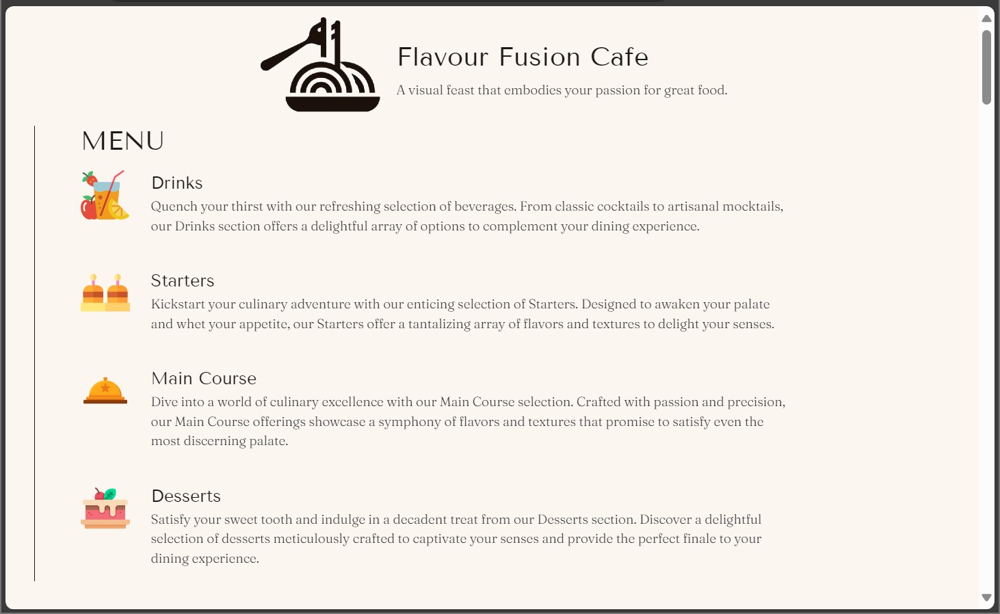

### Details in each food card

Under each section, food items are displayed in **Cards**. Each card contains the following information of the corresponding food items.

1. Image of the food item
2. Food name
3. Brief description of the item
4. Filter names (for example, _egg-free_, _vegan_, _vegetarian_, etc.)
5. Price

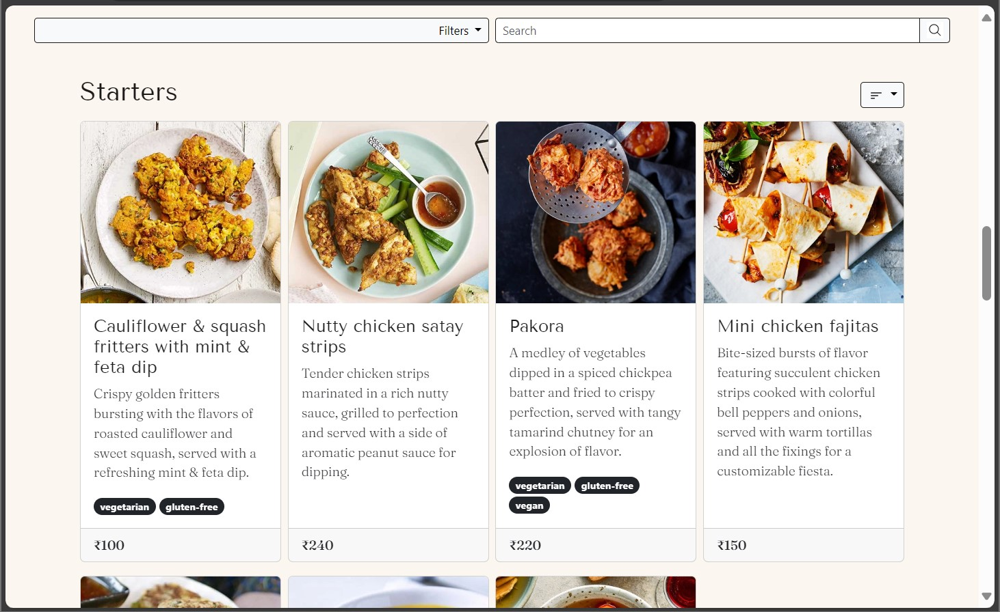

### Filtering food items in the menu

A **Filter** feature is implemented where user can filter food items with options like _egg-free_, _vegan_, _vegetarian_, etc. and all the sections will be filtered with those respective options. Only food items containing those filter tags will be shown from each section. User can choose one or more than one filter and the chosen filters get displayed in the UI for better user experience.

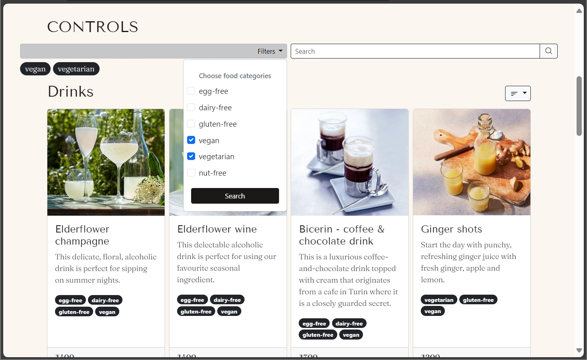

### Searching food items in the menu

A **Search** option is implemented where user can search for food items having a particular keyword in their name and can search across all the food sections. The app matches the input search string with the names of the food items in all the food sections, and if a match is found, it is displayed. If no match is found for a particular section, an appropriate message is displayed.

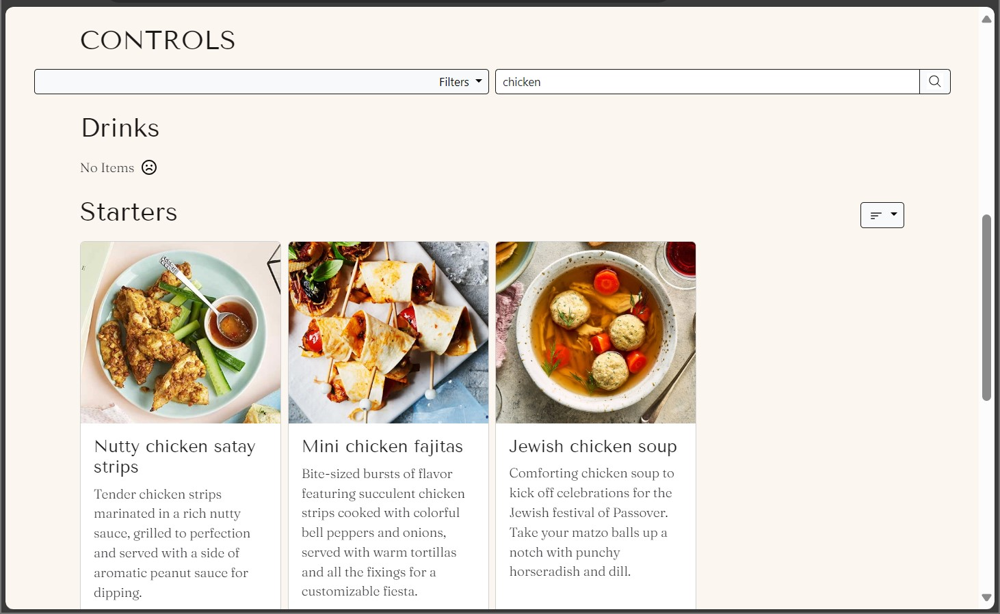

### Sort each section by price

Each section has a **Sort By** option where user can sort the price of food items either from high to low or low to high and the food items will be displayed in that order. Any filters or search strings applied will be respected and the data will be displayed accordingly.

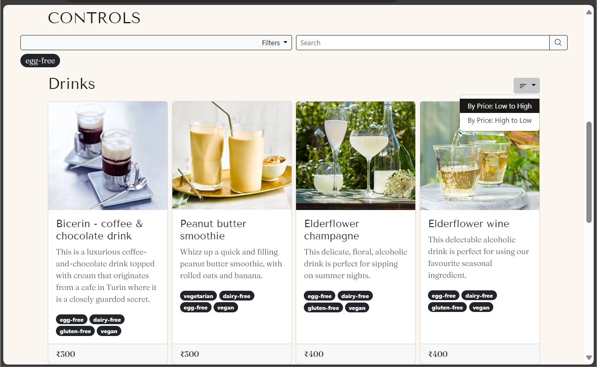

### Fixed filter and search section for better usability

When user scrolls the website, the **Filter** and the **Search** controls are fixed at the top of the viewport so that user can get easy access to these features from wherever they are in the website. This adds to better usability of the website.

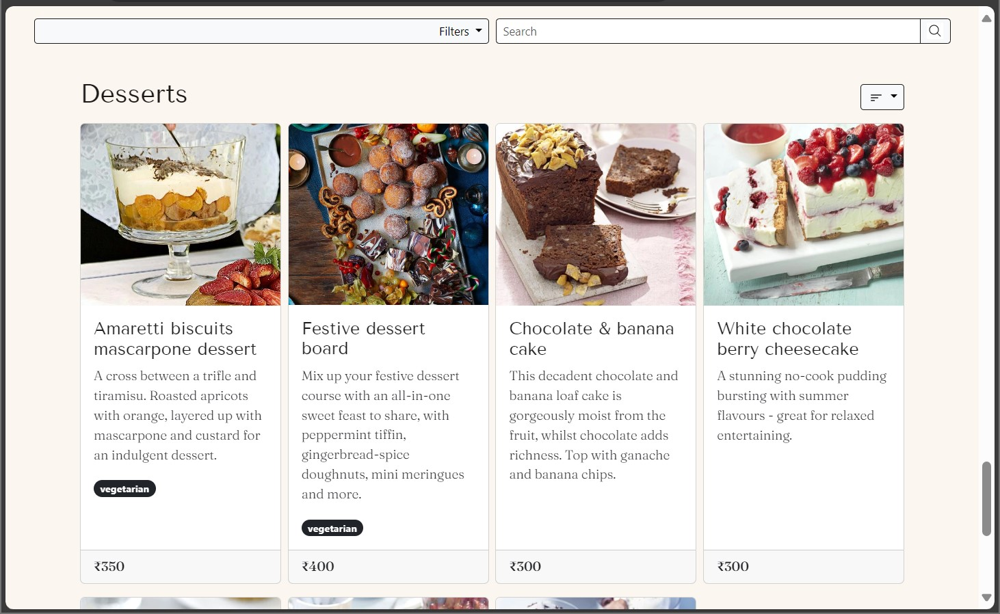

### Responsive design

The webpage is made responsive by design so that users can enjoy a seamless experience both in bigger screens like laptops and desktops as well as in smaller screens like mobiles and tablets.

#### Desktop view

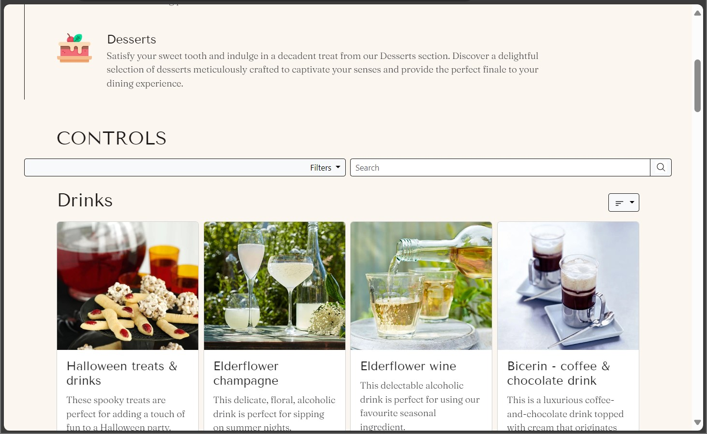

#### Tablet view

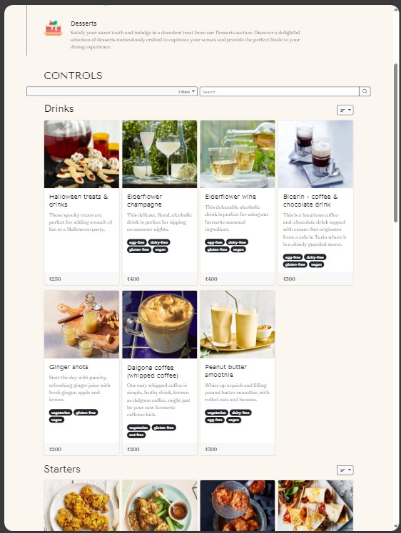

#### Mobile view

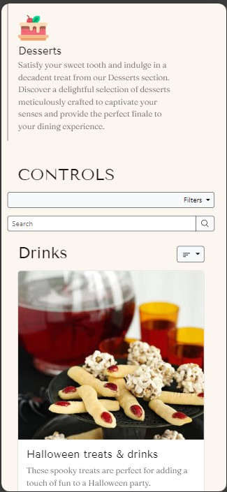

## Setup Instructions

**Step 1:** Clone the GitHub repository in local system.

```bash
git clone https://github.com/soumalyapakrashi/restaurant-menu.git
```

**Step 2:** Open the downloaded folder in [VSCode](https://code.visualstudio.com/) (or any other editor of choice).

**Step 3:** Install the _Live Server_ extension of VSCode by Ritwick Dey from the _Extensions_ tab (or respective Live Server application for editor of choice).

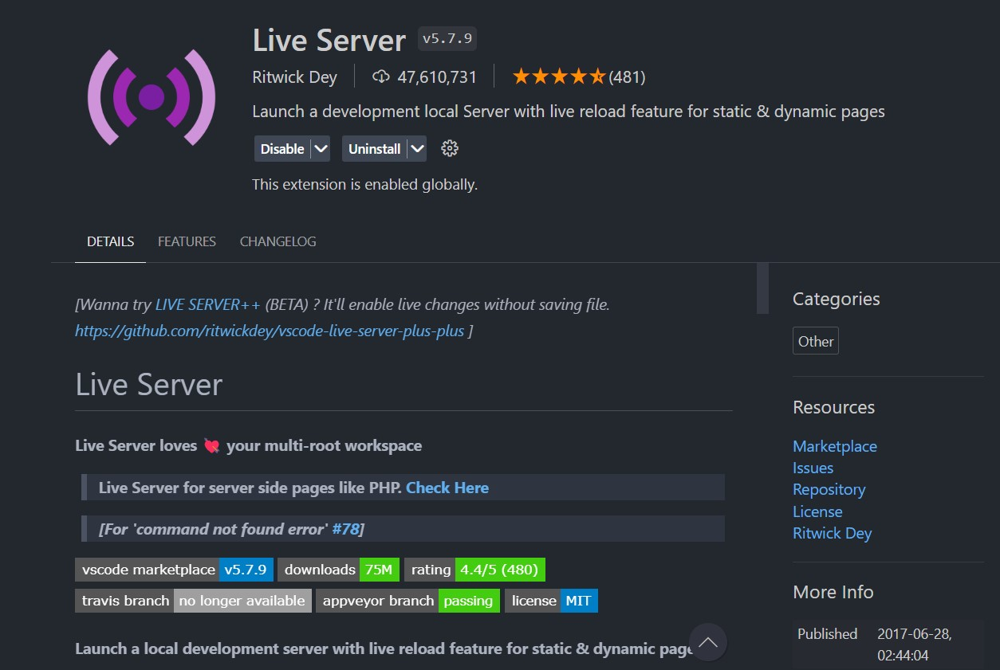

**Step 4:** Open the `index.html` file in VSCode and click on the _Go Online_ button. It will open the website in the default browser.

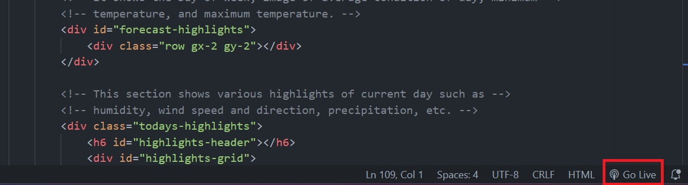

## References

1. UI Kit: [Bootstrap 5](https://getbootstrap.com/)
2. Icon SVGs from [SVGRepo](https://www.svgrepo.com/).
3. Food data and details from [BBC Good Food](https://www.bbcgoodfood.com/).
